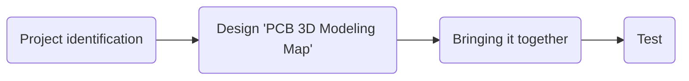

# hirob-em-mechanical

# Welcome to hirob-em-mechanical!

  Hello there!
# Our goals

 **To bring the project to a good end with the harmony within the team and to learn **

# Step By Step
- >Designing the specific model according to the specified circuit elements and PCB
- >Realization of the 3D modeled prototype with the help of CNC
- >Tests

